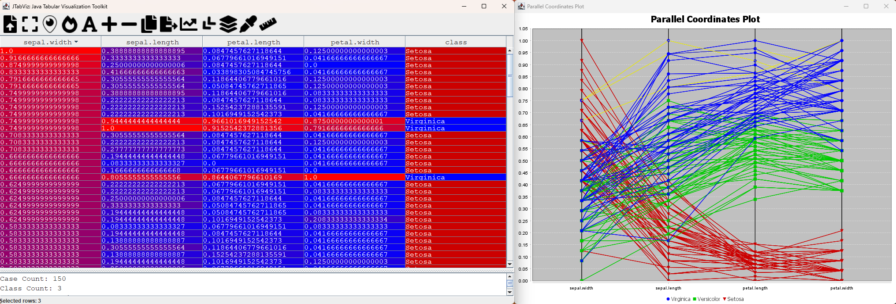
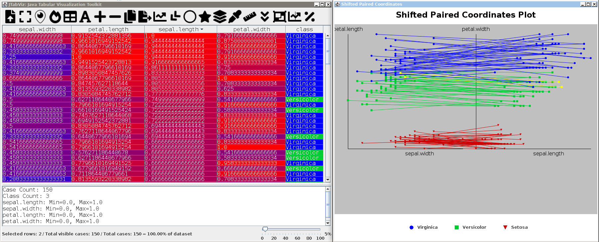
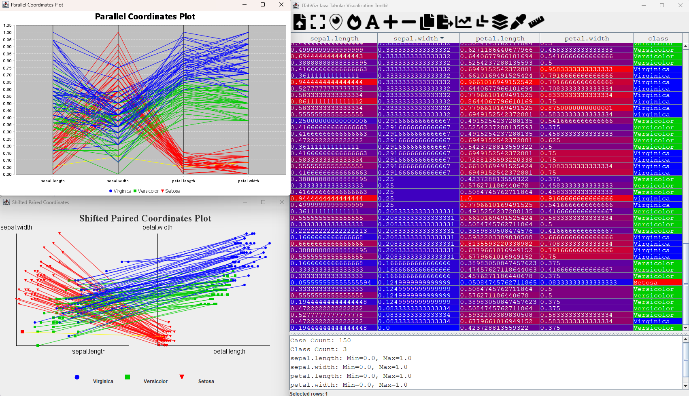
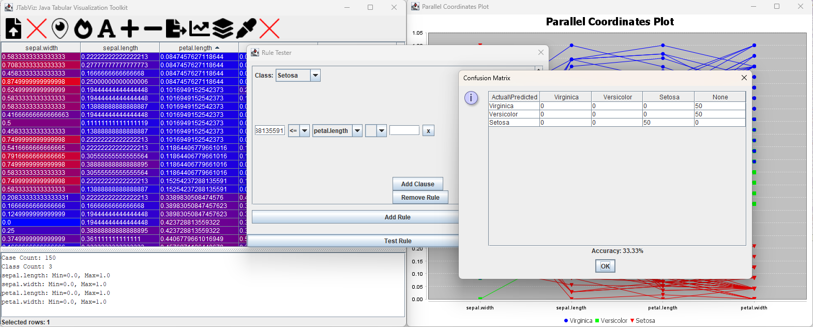

# JTabViz: Java Tabular Visualization Toolkit

**JTabViz** is a Java-based application for loading, viewing, augmenting, and classifying tabular machine learning data loaded from CSV files. The application provides features including normalization, heatmap visualization, row deleting, row insertion, field augmentation, Parallel Coordinates, rules testing, and data export.

We are now implementing additional custom visualization techniques with the utilized libraries (Java Swing, JFreeChart).

Fisher Iris Data Exploration Demo.


Shifted Paired Coordinates Demo.


Combined View Demo.


Outlier in Setosa sepal width attribute highlighted.


Rules Tester Demo.


## Features

- **Load CSV Data**: Load and display CSV data in a tabular format.
- **Normalize Data**: Toggle normalization of numerical columns.
- **Highlight Blanks**: Highlight cells with missing data.
- **Heatmap Visualization**: Highlight data rows as a heatmap.
- **Parallel Coordinates Visualization**: View data in a Parallel coordinates (PC) plot.
- **Shifted Paired Coordinates Visualization**: View data in a Shifted Paired coordinates (SPC) plot.
- **Row Manipulation**: Insert, delete, clone, and reorder rows.
- **Font Color Customization**: Customize the font color of table cells.
- **Tabular Class Field Highlight**: Highlight class fields with color.
- **Data Export**: Export modified data to CSV.
- **Rules Tester**: Test classification rules and save them.
- **Multi-row Select and Drag Reorder**: Select and reorder multiple rows.
- **Tabular Cell Copy**: Copy cell content with Ctrl+C.
- **Rows Selected Highlight**: Selected rows in tabular view highlight in PC and SPC.

## Getting Started

To run this project you need to compile to project along with the contained library in `libs\`. To do so there is three steps:

With our Pre-Compiled Jar:

1; Run from jar

```sh
java -cp ".;libs/*;JTabViz.jar" src.CsvViewer
```

Stand-alone:

1; Clone the project to your computer:

```sh
git clone git@github.com:AvaAvarai/jtabviz.git
```

2; Compile the project:

```sh
javac -cp ".;libs/*" src/CsvViewer.java
```

3; Execute the compiled project:

```sh
java -cp ".;libs/*" src/CsvViewer
```

With a Jar:

1; Compile a jar

```sh
jar cfm JTabViz.jar MANIFEST.MF -C out .
```

2; Run from jar

```sh
java -cp ".;libs/*;JTabViz.jar" src.CsvViewer
```

## Data Format

Data used should be stored in a .csv file, ideally numerical, however, this software should accept blank fields. The label column should be titled `class`, case-insensitive.

## Aknowledgements

The user interface icons used are source from Font Awesome.

## License

The software is freely available for personal and commerical use under the MIT license see `LICENSE` for full details.
