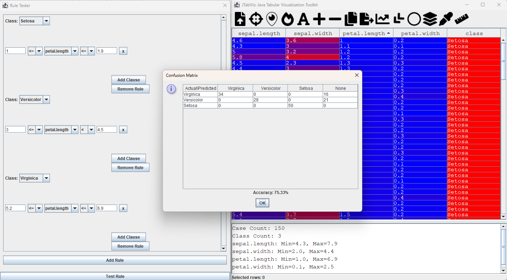

# JTabViz: Java Tabular Visualization Toolkit

**JTabViz** is a Java-based machine learning data analysis toolkit designed for data scientists and machine learning practitioners to easily analyze and visualize tabular data used for building visual machine learning models. With data augmentation features, users can explore how changes in the dataset affect resultantly trained models. Load, view, analyze, and classify CSV data with key features of normalization, visualization (heatmaps, Parallel, Shifted Paired, and Static Circular coordinates), row manipulation, cell editing, inequality-based classification rules testing, analytical rule discovery automation, feature engineering, attribute sorting, and data export.

Visualizing the MNIST Train data in SPC.


Exploring Fisher Iris data highlighting sepal width outliers for Virginica class.


Shifted Paired Coordinates highlighting a potential misclassification in the Virginica class based on sepal width.


Static Circular Coordinates Demo highlighting a petal length outlier in the Virginica class.


Combined View Demo.


Outlier in Setosa sepal width attribute highlighted.


Rules Tester Demo.


Classifying Fisher Iris data with a single attribute for 75% of dataset.


## Features

- Load and display CSV data in tabular view
- Normalize numerical columns
- Highlight missing data
- Visualize data as a heatmap, Parallel Coordinates (PC), Shifted Paired Coordinates (SPC), and Static Circular Coordinates (SCC)
- Manipulate rows (insert, delete, clone, copy contents of selection, edit individual cell values)
- Customize font color and highlight class fields
- Export modified data to CSV
- Test classification rules displaying results in Confusion Matrix
- Serialize classification rules to reload
- Highlight selected rows in visualization views (PC, SPC, SCC)
- Analytical single attribute pure region discovery algorithm, i.e. Attribute: petal.length, Pure Region: 0.00 <= petal.length < 0.15, Class: Setosa, Count: 50 (100.00% of class, 33.33% of dataset)
- Rules combinable to keep largest surrounding pure rule
- Cases classifiable with single pure attribute intervals hideable to simplify classifcation problem
- Rule threshold slider to specify required size of rule coverage over class or total dataset.
- Feature column insertion with direct trigonometric attribute values, i.e. arccos(attribute)
- Feature column insertion with forward x[n+1] – x[n] and backward x[n] – x[n-1] differences between attributes wrapped in trigonometric functions:
   This helps uncover various patterns and interactions in the data between attributes.
  - arcsin: Highlights small differences between attributes, making it easier to detect subtle variations.
  - arctan: Emphasizes the slope or rate of change between attributes, useful for understanding trends and gradients.
  - arccos: Focuses on rotational relationships between attributes, revealing how one attribute rotates relative to another.
- Overlay single attribute rule regions on Parallel Coordinates to visualize regions as shaded rectangular regions
- Inserted columns can be deleted by double-left clicking on their header.
- Feature column engineering with insertion of linear combination column, with custom coefficients per attribute, optionally wrapped in a trigonometric function.
- Gradient descent search for coefficients which optimize score function designed to maximize between-class variance and minimize within-class variance (fast and automatic quality coefficient discovery.)

## Automatic Rule Discovery

For classifying of data we automatically discover pure regions, intervals within a single attribute where all data points belong to the same class.

### Single Attribute Pure Intervals

Using a sliding window algorithm we automatically identify pure intervals within individual attributes based on a single attribute. After identifying all potential pure regions, JTabViz filters them to ensure only the most significant regions are used for classification, eliminating regions which contain another or if the threshold slider is not met for total percentage of class or dataset contained.

## Trigonometric Differences

To better analyze relationships between attributes, JTabViz applies trigonometric functions to the forward differences, backward differences, and direct attribute values. This helps uncover various patterns and interactions in the data between attributes.

- arcsin: Highlights small differences between attributes, making it easier to detect subtle variations.
- arctan: Emphasizes the slope or rate of change between attributes, useful for understanding trends and gradients.
- arccos: Focuses on rotational relationships between attributes, revealing how one attribute rotates relative to another.

## Feature Engineering with Linear Combinations for Data Classification

### Overview

In data classification, feature engineering transforms raw data into a more suitable form for building models. **JTabViz** includes a technique to create **Linear Combination Features** from existing attributes in your dataset. This method allows for the synthesis of new features that can reveal patterns and relationships not immediately visible in the original data.

### What Are Linear Combination Features?

A **Linear Combination Feature** is a new feature created by combining multiple existing features using a set of coefficients. It is mathematically represented as:

New Feature} = c_1(x_1) + c_2(x_2) + ... + c_n(x_n)

where:
c_1, c_2, ..., c_n are the coefficients.  
x_1, x_2, ..., x_n are the original features.

These coefficients can be manually specified or automatically optimized using gradient descent.

### Why Use Linear Combination Features?

Linear Combination Features are used to:

- **Enhance Class Separability**: Combining features can create new dimensions where different classes are more distinguishable.
- **Reduce Dimensionality**: A well-crafted linear combination can summarize the essential information of multiple features into a single feature.
- **Improve Model Representation**: Creating new features based on the relationships between existing features can make the data more suitable for classification.

This feature is inspired by the successful dynamic coordinate mappings of General Line Coordinats developed at Central Washington University.

### Automatic Coefficient Optimization with Gradient Descent

JTabViz includes a gradient descent algorithm that automatically finds the optimal coefficients for your linear combination feature. The optimization process aims to:

- **Maximize Between-Class Variance**: Increase the distance between the centers of different classes.
- **Minimize Within-Class Variance**: Reduce the spread of data points within the same class.

This approach ensures that the resulting linear combination feature is effective in separating different classes.

### Wrapping Linear Combinations with Trigonometric Functions

JTabViz allows you to apply trigonometric functions like `sin`, `cos`, or `tan`, as well as their inverses, `arcsin`, `arccos`, or `arctan`, to the linear combination feature. These transformations can reveal non-linear relationships and rotational patterns in the data, which may not be visible in the original features.

For example:

- **Sin**: Emphasizes periodic or cyclic relationships between features.
- **Cos**: Highlights rotational patterns and relationships.
- **Tan**: Focuses on the slope or rate of change between features.
- **Arcsin**: Shows the angle whose sine is the linear combination value, often highlighting small differences.
- **Arccos**: Represents the angle whose cosine is the linear combination value, useful for rotational relationships.
- **Arctan**: Provides the angle whose tangent is the linear combination value, emphasizing the slope or direction.

### Practical Example

Suppose you have a dataset with features `x1`, `x2`, and `x3`, and you want to create a new feature that helps distinguish between classes. Using JTabViz, you might create a linear combination feature like:

New Feature = 0.5(x1) + 0.3(x2) - 0.2(x3)

If this linear combination is wrapped with the `cos` function, the new feature becomes:

Transformed Feature = cos(0.5(x1) + 0.3(x2) - 0.2(x3))

This transformed feature could provide better insight into the relationships between the features and improve the classification of data.

### Summary

The **Linear Combination Feature Engineering** tool in JTabViz allows you to combine existing features and optimize their relationships to create new features. This approach can help in making the data more suitable for classification tasks.

## Getting Started

There are three ways to run JTabViz:

1. Using the pre-compiled JAR file:
   - Download the `JTabViz.jar` file and the `libs` folder.
   - Open a terminal and navigate to the directory containing the JAR file.
   - Run the following command:

     ```sh
     java -cp ".;libs/*;JTabViz.jar" src.Main
     ```

2. Compiling and running from source:
   - Clone the repository:

     ```sh
     git clone https://github.com/AvaAvarai/jtabviz.git
     ```

   - Navigate to the project directory.
   - Compile the project:

     ```sh
     javac -cp ".;libs/*" src/Main.java
     ```

   - Run the compiled project:

     ```sh
     java -cp ".;libs/*" src/Main
     ```

3. Creating and running your own JAR file:
   - Follow steps 1 and 2 of the "Compiling and running from source" method.
   - Create a JAR file:

     ```sh
     jar cfm JTabViz.jar MANIFEST.MF -C out .
     ```

   - Run the created JAR file:

     ```sh
     java -cp ".;libs/*;out/JTabViz.jar" src.Main
     ```

Note: Replace `;` with `:` in the classpath (-cp) if you're using a Unix-based system (Linux, macOS).

## Data Format

JTabViz accepts data in CSV (Comma-Separated Values) format. Here are the key points about the expected data format:

1. File Extension: The data file should have a .csv extension.

2. Data Types:
   - Numerical data is preferred for optimal visualization and analysis.
   - Non-numerical data and blank fields are also accepted.

3. Class Column:
   - A column representing the class or category of each data point is expected.
   - This column can appear in any position.
   - Should be titled 'class' (case-insensitive, so 'Class' or 'CLASS' are also acceptable).
   - The class column is used for color-coding and shape assignment in various visualizations.

4. Header Row:
   - The first row of the CSV file should contain column names.

5. Delimiter:
   - Values should be separated by commas.

Example CSV structure:

| x1    | x2    | x3    | x4    | x5    | class |
|-------|-------|-------|-------|-------|-------|
| 3.14  | 2.71  | 1.41  | 0.58  | 1.73  | A     |
| 2.22  | 4.44  | 3.33  | 1.11  | 5.55  | B     |
| 0.87  | 1.23  | 3.45  | 5.67  | 7.89  | A     |
| 9.99  | 8.88  | 7.77  | 6.66  | 5.55  | C     |
| 1.23  | 4.56  | 7.89  | 2.34  | 5.67  | B     |

## Acknowledgements

The user interface icons used are sourced from Font Awesome.

## License

The software is freely available for personal and commercial use under the MIT license, see `LICENSE` for full details.
